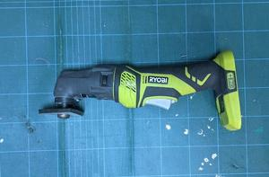
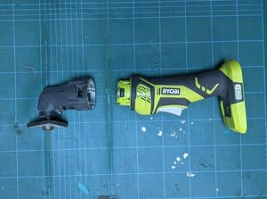
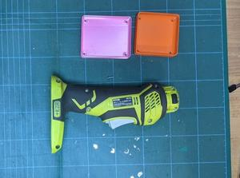
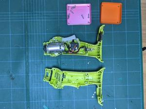
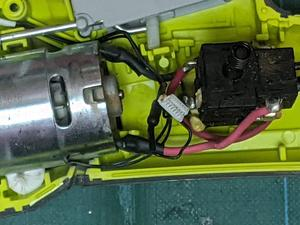
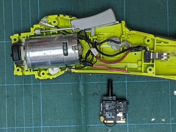

# Oomp Teardown Multitool Ryobi RMT1801
Oomp Teardown Multitool Ryobi RMT1801

Oomp Teardown Multitool Ryobi RMT1801  

## disassembly
### step: 1
  
ready to teardown
### step: 2
  
the cutting head removed
### step: 3
  
remove 8 screws using a torx 10 screwdriver
### step: 4
  
pull the clamshell apart
### step: 5
  
chip away the glue securing the multi pin connector and unplug it
### step: 6
  
desolder the four wires connected to the switch

