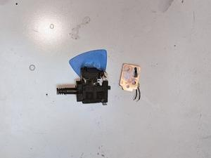
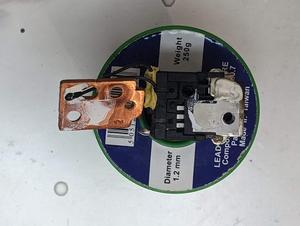
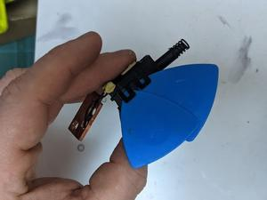
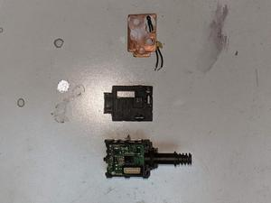

# Oomp Teardown Multitool Ryobi RMT1801
Oomp Teardown Multitool Ryobi RMT1801

Oomp Teardown Multitool Ryobi RMT1801  

## tools
* torx 10 screwdriver - torx 10 screwdriver)
* philips screwdriver - philips screwdriver)

## disassembly
### step: 1
  
Ready to teardown.
### step: 2
  
Remove the cutting head.
### step: 3
  
Remove 8 screws using a torx 10 screwdriver.
### step: 4
  
Pull the clamshell apart.
### step: 5
  
Chip away the glue securing the multi pin connector and unplug it.
### step: 6
  
Desolder the four wires connected to the switch.
### step: 7
  
Using a philips screwdriver remove the two heatsink screws.
### step: 8
  
Desolder the thermistor from the board. Leave it attached to the heatsink.
### step: 9
  
There are 8 plastic clips securing the shell on, try your best to unclip and wedge them open.
### step: 10
  
Pull the shell apart. This is tricky because the wires are soldered on after the shell is put together. Remove as much solder from the tabs as possible. I couldn't get enough removed so also needed to heat the tabs enough to melt the plastic to force a bigger hole.

## disassembly parts
* q1 - mxp4002at - main driver - n channel mosfet mxp4002at 262 amp 40 v gds - [datasheet](images/q1.pdf)

